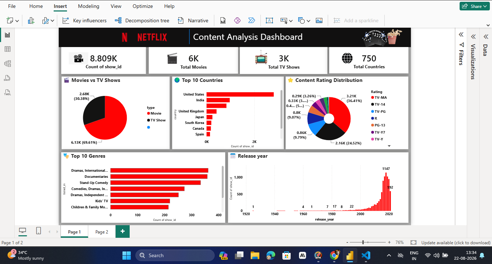
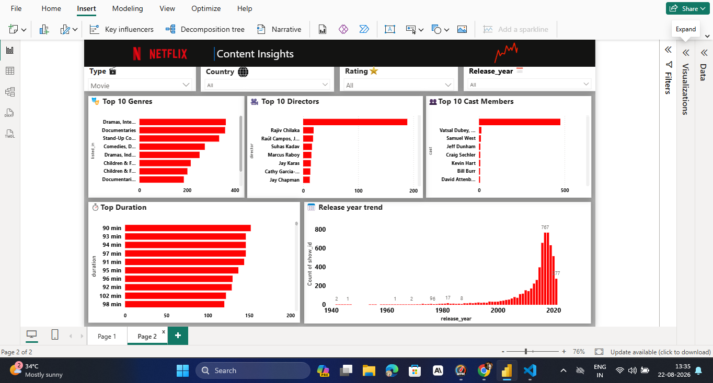

# 🎬 Netflix Movies & TV Shows Analysis

## 📌 Project Overview

This project focuses on analyzing the **Netflix Movies and TV Shows dataset** using Python for Exploratory Data Analysis (EDA) and Microsoft Power BI for interactive dashboard development.

The goal is to understand Netflix's content library, identify important trends, and present meaningful insights through data visualization.

---

## 🎯 Objectives

* Analyze Netflix Movies and TV Shows
* Compare Movies vs TV Shows
* Analyze content by country
* Explore content ratings
* Analyze release-year trends
* Identify popular genres
* Perform data cleaning and exploratory analysis
* Build an interactive Power BI dashboard
* Generate meaningful business insights

---

## 🛠️ Tools & Technologies

| Tool             | Purpose                      |
| ---------------- | ---------------------------- |
| Python           | Data Analysis                |
| Pandas           | Data Cleaning & Manipulation |
| NumPy            | Data Processing              |
| Matplotlib       | Data Visualization           |
| Seaborn          | Statistical Visualization    |
| Jupyter Notebook | EDA                          |
| Power BI         | Interactive Dashboard        |
| Power Query      | Data Transformation          |

---

## 📂 Project Structure

```text
EDA_Netflix_Analysis/
│
├── data/
│   └── netflix_titles.csv
│
├── image/
│   ├── Dashboard_Page1.png
│   └── Dashboard_Page2.png
│
├── notebook/
│   └── EDA_Netflix.ipynb
│
├── Netflix Dasboard.pbix
│
├── requirements.txt
│
└── README.md
```

---

## 🔍 Exploratory Data Analysis

The Python analysis covers:

* Data cleaning
* Missing value analysis
* Duplicate checking
* Movie vs TV Show analysis
* Country-wise analysis
* Rating analysis
* Genre analysis
* Release year analysis
* Duration analysis
* Content trend analysis

---

## 📊 Power BI Dashboard

The project includes an interactive **Power BI Dashboard** designed to provide a clear overview of Netflix's content library.

### Dashboard Page 1



### Dashboard Page 2



---

## 💡 Key Insights

Some important insights from the analysis include:

* 🎬 Movies represent a larger portion of Netflix's content library than TV Shows.
* 🌎 Netflix contains content from countries across the world.
* 🇺🇸 The United States is one of the major contributors of Netflix content.
* 🔞 TV-MA is one of the most frequently occurring ratings.
* 📈 Netflix's content library has grown significantly over the years.
* 🎭 Netflix offers content across a wide range of genres.
* 📺 TV Show content has expanded considerably in recent years.

---

## 📈 Business Questions

This project answers questions such as:

1. How many Movies and TV Shows are available on Netflix?
2. Which type of content dominates Netflix?
3. Which countries produce the most content?
4. What are the most common content ratings?
5. How has Netflix's content library changed over time?
6. Which genres are most popular?
7. Which years saw the highest growth in Netflix content?
8. How diverse is Netflix's global content library?

---

## 🚀 How to Run the Project

### 1. Clone the Repository

```bash
git clone https://github.com/Avanishyadav48/EDA_Netflix_Analysis.git
```

### 2. Install Required Libraries

```bash
pip install -r requirements.txt
```

### 3. Open the Jupyter Notebook

Open the notebook available inside the `notebook` folder and run the cells sequentially.

### 4. Open the Power BI Dashboard

Open:

```text
Netflix Dasboard.pbix
```

using **Microsoft Power BI Desktop**.

---

## 📚 Dataset

The project uses the **Netflix Movies and TV Shows dataset**, containing information such as:

* Title
* Type
* Director
* Cast
* Country
* Date Added
* Release Year
* Rating
* Duration
* Genre
* Description

---

## 🎓 Skills Demonstrated

This project demonstrates practical skills in:

* Data Cleaning
* Exploratory Data Analysis
* Data Visualization
* Python
* Pandas
* NumPy
* Power BI
* Power Query
* Dashboard Development
* Business Intelligence
* Data Storytelling

---

## 👨‍💻 Author

**Avanish Yadav**

Data Analytics Enthusiast

---

## ⭐ Support

If you find this project useful, consider giving the repository a ⭐ on GitHub.
